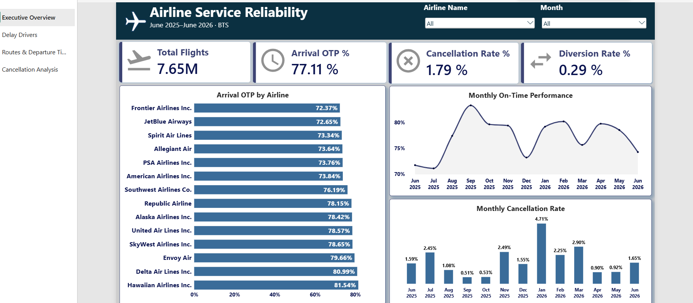
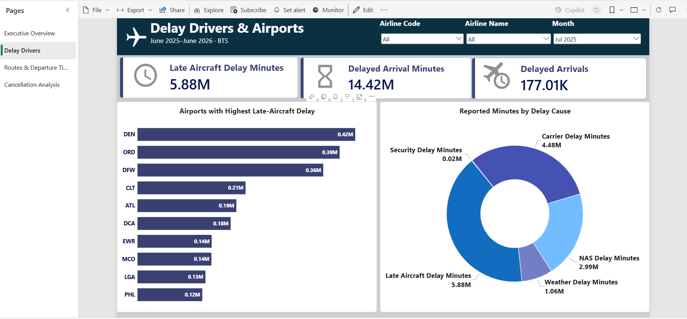
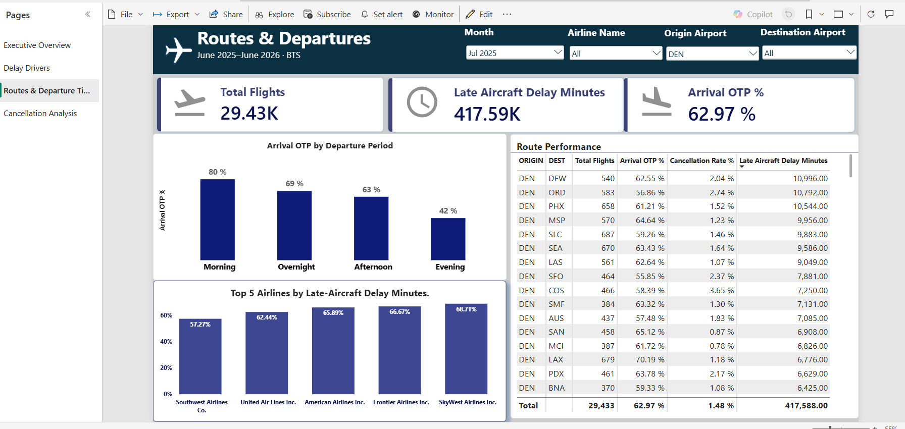
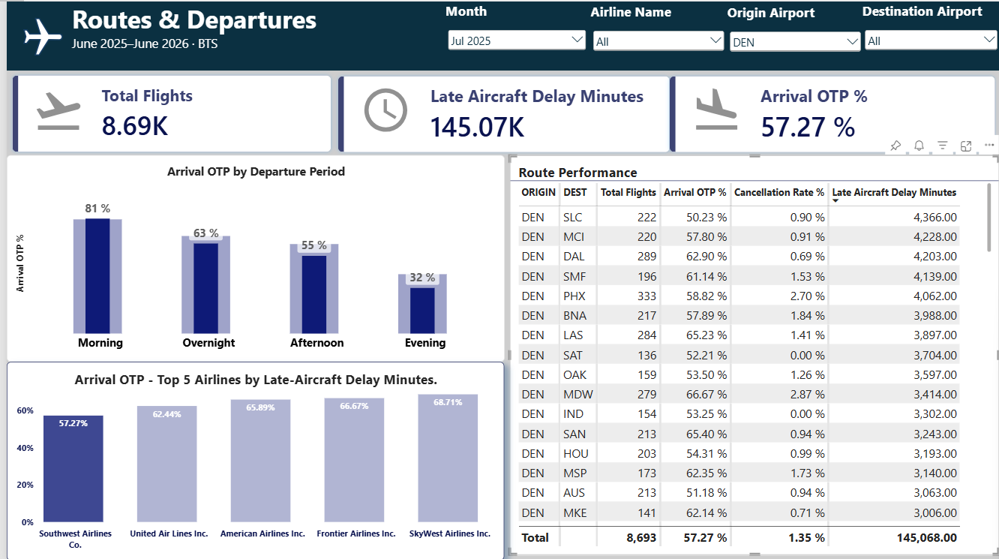
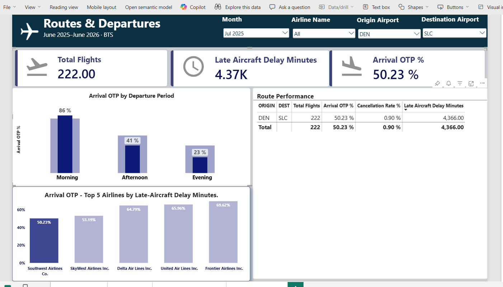
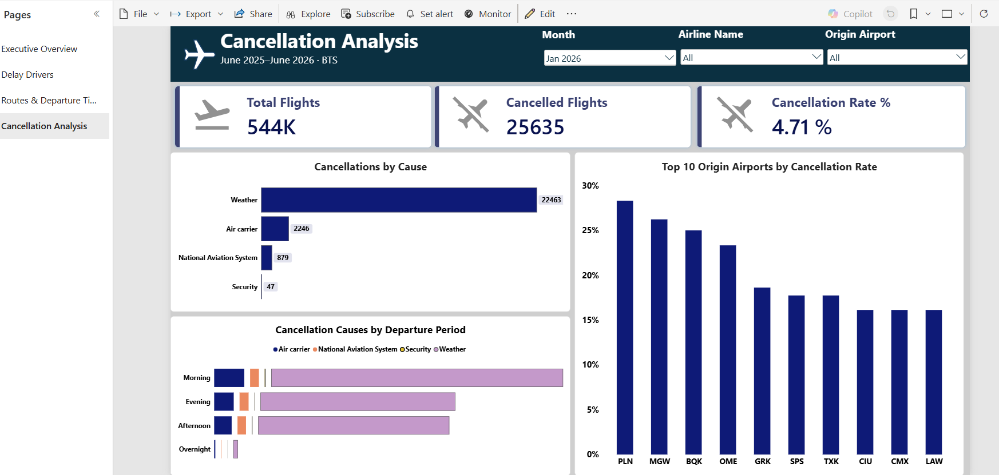

# Airline Service Reliability Analysis

**Helping airline teams decide where to focus reliability improvements.**

This independent portfolio project examines **7.65 million flight records** to understand where service reliability breaks down and which operational questions deserve attention. The investigation identified two priorities: late-aircraft disruption on selected evening services and preparation for weather-related cancellations.

**Study period:** June 2025–June 2026 · **Coverage:** 14 operating airlines and 358 airports

## 1. Problem Statement

An overall on-time percentage shows how reliably flights arrive, but it does not explain where an airline should act. Late arrivals and cancellations also require different responses.

The central question was:

> Which months, airports, airlines, routes, and departure periods have the greatest reliability problems, and what should teams investigate first?

| Stakeholder | Decision this analysis supports |
|---|---|
| Operations leadership | Prioritize reliability problems for further investigation |
| Network planning and scheduling | Identify routes and departure periods that warrant a schedule review |
| Operations control and airport teams | Examine incoming-aircraft delays and recovery between flights |
| Customer service | Plan earlier communication and passenger recovery during disruption |

## 2. Data Understanding

The analysis uses the Bureau of Transportation Statistics’ [Reporting Carrier On-Time Performance data](https://www.transtats.bts.gov/TableInfo.asp?QO_fu146_anzr=b0-gvzr&gnoyr_VQ=FGJ). The selected extract contains **7,654,891 flight records across 13 months**, including airlines, airports, flight times, reported delays, cancellations, and diversions.

| Reliability measure | Result across the study period |
|---|---:|
| Scheduled flights | 7,654,891 |
| Arrival on-time performance | 77.11% |
| Cancelled flights | 137,060 |
| Cancellation rate | 1.79% |
| Diversion rate | 0.29% |

An on-time arrival is less than 15 minutes late. Arrival performance covers flights with sufficient arrival information that were neither cancelled nor diverted. Cancellation and diversion rates use all scheduled flights, keeping those disruptions visible alongside arrival performance.

## 3. Analytical Approach

The investigation followed four business questions:

1. **When was reliability weakest?** Compare every month before selecting a period for deeper analysis.
2. **Which reported causes contributed most?** Separate late-aircraft, carrier, weather, airspace-system, and security disruption.
3. **Where was the problem concentrated?** Compare airports and airlines, then examine routes and departure periods.
4. **What should change next?** Translate the evidence into operational reviews and define how a future intervention could be evaluated.

The interactive report supports this investigation through four pages:

| Report page | Purpose |
|---|---|
| Executive Overview | Compare overall reliability, airlines, and monthly trends |
| Delay Drivers | Understand reported delay causes and affected airports |
| Routes & Departure Times | Compare services by airline, route, and departure period |
| Cancellation Analysis | Explore cancellation causes, departure periods, and airport cancellation rates |

Filters let users move from the overall picture to the services relevant to their decisions.

## 4. Key Insights

### Overall report: where should the investigation start?

Across 7.65 million flights, arrival on-time performance was **77.11%**. The monthly trends point to two different questions: why July 2025 had weak arrival performance, and why January 2026 had many cancellations.

*Report: Executive Overview, all airlines, June 2025–June 2026.*

### July’s weakest arrival performance pointed to late-aircraft disruption

**July 2025 had the lowest arrival on-time performance at 71.11%.** Late aircraft accounted for **40.79% of reported delay minutes** that month, making it the largest reported cause.

Denver (DEN) recorded the most late-aircraft delay minutes among origin airports in July: **417,588 minutes**. This is a month-specific finding; Chicago O’Hare led the corresponding total across the full study period.

*July 2025, all airlines — late aircraft contributed 5.88 million reported minutes. DEN led the origin-airport ranking with approximately 0.42 million minutes. Airport bars show total minutes, not a delay rate.*

**Business implication:** Start the review with incoming-aircraft delays and recovery between flights at the affected services. The recorded cause points to disruption carried forward from an earlier flight; it does not establish what originally delayed that aircraft.

### A route comparison exposed a substantial evening reliability gap

Southwest was selected for a closer review because it combined substantial Denver flight volume with the lowest arrival performance among the five airlines contributing the most late-aircraft minutes there in July.

*July 2025, origin DEN, all airlines and destinations — 29,433 scheduled flights and 62.97% arrival OTP. The lower chart shows arrival OTP percentages for the five airlines selected by highest late-aircraft delay minutes.*

### Southwest’s Denver flights narrowed the investigation

In July, Southwest operated **8,693 flights from Denver**, with **57.27%** arriving on time. It recorded **145,068 late-aircraft delay minutes** there, so its Denver routes were a useful next step for a focused review.

*Report: Routes & Departure Times, July 2025, Denver origin, Southwest selection, all destinations.*

### Denver–Salt Lake City: evening flights had the weakest results

For **Southwest’s DEN–SLC service in July 2025**:

| Departure period | Scheduled flights | Arrival on-time performance |
|---|---:|---:|
| Morning | 77 | 85.71% |
| Evening | 83 | 23.46% |

*July 2025, DEN–SLC, Southwest selected in the airline chart — 222 scheduled flights across all departure periods, 50.23% overall arrival OTP, and 4,366 late-aircraft delay minutes. The chart rounds morning and evening OTP to 86% and 23%; the table above retains the validated two-decimal values. The 222 flights include afternoon services as well as morning and evening.*

Evening performance was **62.25 percentage points lower**. Of the 83 scheduled evening flights, **61 recorded late-aircraft delay**. Morning services also had higher arrival on-time performance in every one of the 13 months examined for this airline and route.

**Business implication:** Prioritize evening aircraft rotations, turnaround allowances, and recovery options for review. The comparison identifies a recurring pattern, but does not prove that departure time itself caused the delays.

### January’s cancellation peak required a different response

**January 2026 had the highest cancellation rate: 4.71%.** There were **25,635 cancellations**, of which **22,463—87.63%—were reported as weather-related**.

*January 2026, all airlines and origin airports — weather accounts for 22,463 of 25,635 cancellations. The airport chart ranks cancellation rates; scheduled-flight volumes must be checked before setting airport priorities.*

The departure-period analysis showed the largest cancellation count in the morning. This describes the number of cancelled flights, not the probability of cancellation for a scheduled morning flight.

**Business implication:** Focus the next review on weather contingency preparation, recovery arrangements, and passenger communication. The analysis does not identify a specific storm or establish weather conditions at each airport.

## 5. Business Impact & Recommendations

The project provides a consistent view of reliability and a clear route from broad performance measures to specific operational questions.

| Priority | Recommended action | Lead stakeholders | How to evaluate a future intervention |
|---|---|---|---|
| Late-aircraft disruption | Review incoming-aircraft sequences and recovery between flights | Operations control and airport operations | Late-aircraft minutes per 100 flights and arrival on-time performance |
| Evening route performance | Review rotations and test targeted scheduling changes if operational evidence supports them | Network planning and scheduling | Arrival performance and cancellation rates for comparable services |
| Weather-related cancellations | Review contingency preparation and earlier passenger recovery arrangements | Operations control, airport teams, and customer service | Cancellation rates during comparable events; notification and rebooking times if additional data is available |

**Delivered outcome:** An interactive report, validated performance measures, and evidence-based review priorities. Recommendations have not been implemented or evaluated; no reduction in delays, cancellations, or costs is claimed.

Before allocating resources, airport cancellation rates should be reviewed alongside flight volumes. The analysis is observational, uses broad reported cause categories, and covers only 13 months. Passenger impacts and financial benefits require additional data.

---

For data processing, model design, calculations, and validation, see the [Technical README](README_TECHNICAL.md).
